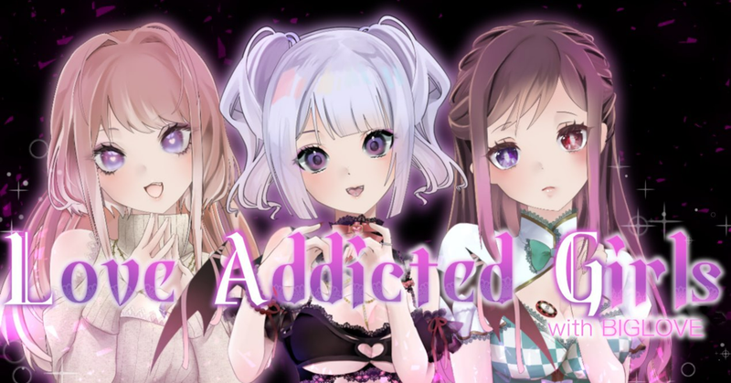

This program is designed to register a lot of NFTs in ThirdWeb using the BulkCreate function of ThirdWeb.
Normally, this program is intended to register about 100~10000 NFTs, and we recommend using the official Web UI for less than 100 NFTs.

# How to install
To install, use node.
```
git clone https://github.com/HayattiQ/thirdweb-bulk-create-script
npm install
```
After that, create a .env file and add settings such as Private Key. Please refer to .env.default to create the file.

After that, you can register the metadata.csv file. Please refer to the example for how to write the metadata.csv file.
It is also recommended to get the image data remotely. Specify the image data stored in Amazon S3, etc. in the path column.

Finally, you can run script.
``` npm run app ```

## About Love Addicted Girl Project



This library was created as part of the Love Addicted Girl project.

Love Addicted Girl is a collection of 2,000 randomly generated NFTs on the Polygon Blockchain. LoveAddicted Girl are meant for buyers, creators, and developers who are completely new to the NFT ecosystem.

The community is Built by SoudanNFT. SoudanNFT is Japanese NFT creator and investor community.